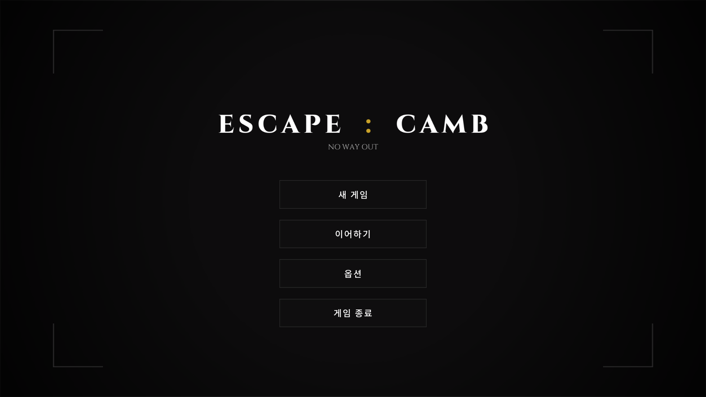
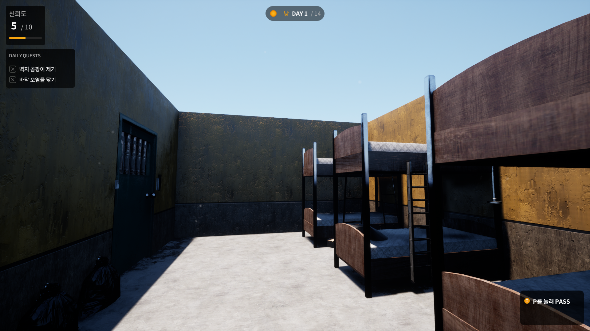
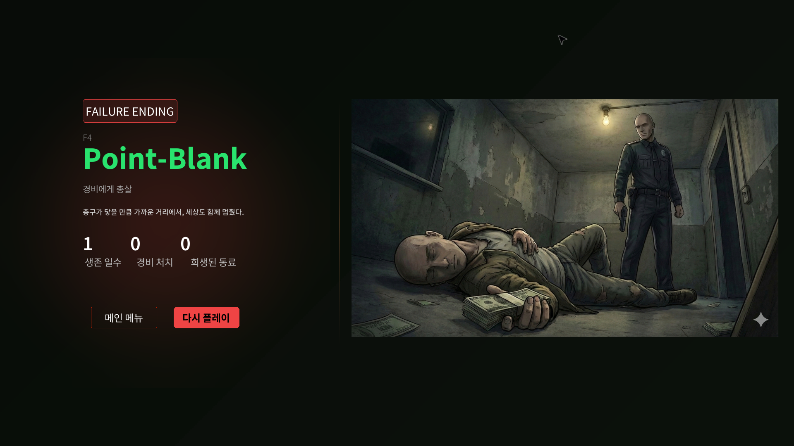

# ABadOmic — 낮 / 밤 탈출 게임 (UE5)

[English](ABadOmic.md) · [한국어](ABadOmic_ko.md) · [日本語](ABadOmic_ja.md)

---

## 한 줄로

**2025 프리랜스**로 참여한 Unreal Engine **5.6** 프로젝트입니다.  
핵심 로직은 **C++** 모듈(`ABadOmic`)로 구성되어 있습니다.

**숙소**를 배경으로 대략 **2주**를 버티는 구조입니다.  
**낮**에는 퀘스트와 신뢰도, **밤**에는 도구·은신·경비 AI.  
선택과 인벤토리에 따라 **Escape / Failure / Hypocrite** 엔딩으로 갈립니다.

원본 소스·전체 기획 소유권은 클라이언트 쪽에 있습니다.  
이 페이지는 코드에 실제로 있는 시스템을 정리한 것이며,  
팀 역할 비율이나 작업 시간 같은 수치는 **다루지 않습니다**.

---

## 프로젝트의 이유

> [!IMPORTANT]
> 원본 소스와 전체 기획 소유권은 클라이언트에 있습니다 — 이 페이지는 코드에서 확인 가능한 범위만 다룹니다.

하루를 두 페이스로 나누되,  
진행의 축은 하나여야 합니다 — **신뢰도 · 아이템 · 플래그**.

낮: 숙소 안의 일상·퀘스트·사회적 압박.  
밤: 도구가 뜨고, 경비가 돌고, 숨는 자리와 타이머가 살아 나는 시간.

엔딩은 보스 한 판이 아니라,  
**여러 날의 작은 선택**이 쌓인 결과로 설계되어 있습니다.

---

## 플레이 루프

```text
로비 / 프롤로그
        │
        ▼
낮  — 퀘스트 · 신뢰도 · 숙소 활동
        │
        ▼
밤  — 도구 · 은신 · 경비 시야 / 추격
        │
        ▼
다음 날 (또는 엔딩 판정)
        │
        ▼
엔딩 레벨  (내러티브 페이지 · 일러스트 · BGM)
```

코드에서 읽히는 대략의 제약:

| 항목 | 동작 |
|:-----|:-----|
| **기간** | 데이 사이클이 최종 구간(~**14일**)까지 진행 |
| **신뢰도** | Reliability, 기본 **5**, 상한 **10** |
| **밤** | 카운트다운(기본 **180초**), 스킵 가능 구간 후 고정 |
| **경비** | 밤 스폰 **수가 신뢰도와 반비례** |

---

## 시스템 구조

```text
UABOGameInstance
  · Item / Quest / Ending DataTable
  · 설정 매니저 · 런 통계 (생존 일수, 킬, 동료)
  · 엔딩 내러티브 페이지 유틸
        │
        ├── UQuestSystem (GameInstanceSubsystem)
        │     일/신뢰 필터 · 가중 선택 · 플래그 · 상호작용
        │
        ├── AABOGameState
        │     낮/밤 · 밤 타이머 · 은신 목록 · 엔딩 오픈
        │
        ├── AABOPlayerState
        │     신뢰도 · HUD 참조 · 킬 / 희생 카운터
        │
        └── AABOGamemode
              낮·밤 경비 스폰 · 주간 추격 · 패트롤 선택

월드 매니저
  EndingManager · ToolSystemManager · BGMManager · AmbienceManager
  QuestObjectiveManager · SleepTypingManager · SequenceManager

캐릭터
  AABOCharacter   — 스프링암 카메라 · 인벤 · 상호작용 / 공격 / 은신
  AGuardCharacter — 시야 콘(프로시저럴 메시) · 패트롤 · 사격 · 어그로
```

### 낮 / 밤

`AABOGameState`가 페이즈를 소유합니다.

- **낮** — 퀘스트 오브젝티브, Day HUD, 낮 BGM, 타이핑하는 숙소 NPC  
- **밤** — 도구 하이라이트, 은신 액터 활성, 밤 경비·패트롤, 밤 BGM, 수면 NPC  
- 전환 시 밤 도구 정리, 랜덤 박스 리스폰, 일일 퀘스트 재배정  

밤에 경비를 죽이면 신뢰도가 크게 떨어지고  
**동료 희생** 루트로 이어질 수 있습니다.  
희생이 임계치를 넘으면 실패 엔딩입니다.

### 신뢰도와 경비

신뢰도는 퀘스트 출현 조건과 밤 난이도를 동시에 먹입니다.

밤 경비 수 (GameMode 기준):

| 신뢰도 | 경비 수 |
|:------:|:-------:|
| ≤ 1 | 5 |
| ≤ 3 | 4 |
| ≤ 5 | 3 |
| ≤ 7 | 2 |
| 그 외 | 1 |

패트롤은 등록된 `AGuardPatrolPath`에서 무작위로 뽑습니다.

### 퀘스트 시스템

`UQuestSystem`은 **GameInstanceSubsystem**이며 DataTable(`FQuestDefinition`) 기반입니다.

- 타입: **Simple / Functional / Conditional**  
- 필터: 일 범위, 특정 일, 신뢰 min/max, 연속 신뢰, 필요 플래그/아이템  
- 보상: 신뢰 변화, 아이템 드롭, 플래그 부여, 다음날 가중 후보  
- 상호작용: 추가 선택(아이템·신뢰·엔딩 링크)  

월드: `AQuestObjective` 계열 + `AQuestObjectiveManager`가  
그날의 배치 오브젝티브를 켭니다.  
청소·쓰레기·침구·창문·배달·컴퓨터·투자·사기(fraud)·쥐약·타격·경비 요청 등  
퀘스트별 UMG가 붙어 있습니다.

### 인벤토리 · 도구

플레이어에 두 층이 있습니다.

| 층 | 역할 |
|:---|:-----|
| **도구** (2슬롯) | Stick / Sharpness / Heavy · 레벨 **I–IV** (상위는 하위 도구 요구가 흔함) |
| **아이템** | **엔딩** 키 또는 **특수** 효과 |

특수 효과 타입:  
Tracker, Bulletproof Vest, Stopwatch, Sneakers, Beer, Guard Uniform, Fur Gloves, Firecracker.

`AToolSystemManager`가 밤 도구·랜덤 박스 스폰/디스폰을 담당합니다.  
인벤토리는 엔딩 조건 검사(E3, E4–E5, E7, E10, E11 등)도 담당합니다.

### 경비 AI

- Behavior Tree + 블랙보드 (`Recognition`, `TargetActor`, 마지막 목격 위치)  
- **시야 콘**: **ProceduralMesh** (반경 / 각도 / 레이 수)  
- 패트롤, 추격, 사격 이펙트, 어그로, 수면 상태  
- 낮: 로직 정지에 가깝게 / 밤: 풀 로직 + 신뢰 기반 스폰  

플레이어는 공격·처치(낮/밤 몽타주), 은신, 어그로 유도를 쓸 수 있습니다.

### 엔딩 시스템

`AEndingManager` + 엔딩 DataTable:

| 카테고리 | 역할 (데이터) |
|:---------|:--------------|
| **Escape** | 탈출·성공 계열 |
| **Failure** | 신뢰 붕괴, 일수 한계, 희생 등 |
| **Hypocrite** | 고신뢰 연속 + 사기 퀘스트 관련 플래그 |

스냅샷: 일수, 신뢰, 동료 희생, 방어 스택, 아이템, 플래그.  
즉시 트리거: 피격, 낮/밤 경비 킬, 폰 충전, 벽 타기, 합선,  
창문 탈출, 뇌물, 독 섞기, 쥐약 훔치기 등.

`UEndingWidget`은 **페이지형 내러티브**(일러스트 + 리치 텍스트 + SFX/BGM) 후  
메인 메뉴 / 리플레이로 이어집니다.  
GameInstance는 `||`로 나뉜 긴 내러티브를 페이지로 쪼갭니다.

### 오디오 · HUD · 메타

| 시스템 | 내용 |
|:-------|:-----|
| **BGMManager** | 낮/밤/추격/엔딩 · 크로스페이드 · 밤 시간 경고 SFX |
| **AmbienceManager** | 낮/밤/위험 레이어 · 긴장도 |
| **HudWidget** | Day + Night HUD · 인벤 · 미니맵 · 은신 프롬프트 · 폰 충전 |
| **Settings** | 영상·오디오 (`UGameSettingsManager` + 세이브 슬롯) |
| **프롤로그 / 로비** | 인트로 위젯, 로비 레벨 흐름 |
| **SleepTypingManager** | 낮 타이핑 / 밤 수면 숙소 NPC |

메인 플레이 맵은 **숙소** 중심입니다.  
로비·엔딩·탑다운/템플릿 맵도 콘텐츠에 포함되어 있습니다.

---

## 코드 발췌

전체 소스는 비공개입니다.  
아래는 단순 if/클램프가 아니라 **여러 시스템이 맞물리는 쪽** 발췌입니다  
(`Source/ABadOmic/…`).

### 1. 경비 시야 콘 (라인트레이스 메시 재생성)

매 틱/컨스트럭션마다 콘을 **벽에 라인트레이스**한 뒤  
**ProceduralMesh** 부채꼴로 다시 만듭니다 (폰 무시 · 벽만 차단).

```cpp
// Character/GuardCharacter.cpp
void AGuardCharacter::DrawVisionCone()
{
	TArray<FVector> Vertices;
	TArray<int32> Triangles;
	// … Normals / UV / colors …

	Vertices.Add(FVector::ZeroVector); // apex

	float CurrentAngle = -ViewAngle / 2.0f;
	float AngleStep = ViewAngle / (float)RayCount;

	for (int32 i = 0; i <= RayCount; i++)
	{
		FRotator Rotation(0.0f, CurrentAngle, 0.0f);
		FVector Direction = Rotation.RotateVector(FVector::ForwardVector);

		FVector WorldStart = GetActorLocation();
		FVector WorldEnd = WorldStart
			+ (GetActorRotation().RotateVector(Direction) * ViewRadius);

		FHitResult HitResult;
		FCollisionQueryParams QueryParams;
		QueryParams.AddIgnoredActor(this);

		// TraceChannel defaults to WorldStatic — walls clip the cone
		bool bHit = GetWorld()->LineTraceSingleByChannel(
			HitResult, WorldStart, WorldEnd, TraceChannel, QueryParams);

		FVector HitPoint = bHit ? HitResult.Location : WorldEnd;
		FVector LocalPoint =
			GetActorTransform().InverseTransformPosition(HitPoint);
		Vertices.Add(LocalPoint);

		if (i > 0)
		{
			Triangles.Add(0);
			Triangles.Add(i + 1);
			Triangles.Add(i);
		}
		CurrentAngle += AngleStep;
	}

	ProceduralMesh->CreateMeshSection(
		0, Vertices, Triangles, Normals, UV0, VertexColors, Tangents, false);
}

void AGuardCharacter::Tick(float DeltaTime)
{
	Super::Tick(DeltaTime);
	DrawVisionCone(); // 회전·이동 중에도 벽 폐색 반영
	// 근접 처치·뇌물 상호작용용 캡슐 프로브 …
}
```

### 2. 일일 퀘스트 선정 (필터 + 가중 추첨 + 듀얼 슬롯)

`StartNewDay`가 DataTable 전체를 돌며 **일/신뢰/플래그/이력** 게이트를 통과시키고,  
강제 1번 슬롯 후 중복 없이 2번 슬롯을 채웁니다.

```cpp
// Framework/QuestSystem.cpp

static const FQuestRowView* PickQuestByWeight(
	const TArray<FQuestRowView>& Candidates, const UQuestSystem* QuestSystem)
{
	TArray<float> EffectiveWeights;
	float TotalWeight = 0.0f;

	for (const FQuestRowView& View : Candidates)
	{
		const float Weight = FMath::Max(
			0.0f,
			QuestSystem->GetEffectiveWeight(View.RowName, *View.Definition));
		EffectiveWeights.Add(Weight);
		TotalWeight += Weight;
	}

	if (TotalWeight <= 0.0f)
		return &Candidates[FMath::RandHelper(Candidates.Num())];

	float Remaining = FMath::FRandRange(0.0f, TotalWeight);
	for (int32 Index = 0; Index < Candidates.Num(); ++Index)
	{
		if (EffectiveWeights[Index] <= 0.0f) continue;
		Remaining -= EffectiveWeights[Index];
		if (Remaining <= 0.0f)
			return &Candidates[Index];
	}
	return &Candidates.Last();
}

void UQuestSystem::StartNewDay(
	int32 Day, int32 Trust, const TArray<FName>& CurrentFlags)
{
	CurrentDay = Day;
	CurrentTrust = Trust;
	// RuntimeFlags rebuild from CurrentFlags …
	CurrentDayQuests.Empty();

	TArray<FQuestRowView> ForcedFirstSlotCandidates;
	TArray<FQuestRowView> GeneralCandidates;

	for (const auto& Pair : QuestTable->GetRowMap())
	{
		const FQuestDefinition* Def =
			reinterpret_cast<const FQuestDefinition*>(Pair.Value);

		if (!DoesQuestMatchDayAndTrust(*Def, CurrentDay, CurrentTrust)) continue;
		if (!DoesQuestMatchConsecutiveTrust(*Def)) continue; // trust history window
		if (!DoesQuestMatchSpecificDays(*Def, CurrentDay)) continue;
		if (!DoesQuestMatchFlags(*Def)) continue;
		if (!Def->bCanRepeat && OneTimeCompletedQuests.Contains(Pair.Key)) continue;

		(Def->bForceFirstSlot ? ForcedFirstSlotCandidates : GeneralCandidates)
			.Add(FQuestRowView(Pair.Key, Def));
	}

	// Slot 0: forced pool first, else weighted general
	// Slot 1: re-filter table excluding FirstQuestId / ForceFirstSlot
	// …
}
```

`DoesQuestMatchConsecutiveTrust`는 롤링 **신뢰 히스토리**를 읽어  
연속 고신뢰 콘텐츠 잠금/해금에 씁니다.

### 3. 엔딩 그래프 — 지연 합선 + 다중 조건 루트

단일 switch가 아닙니다. 선택이 **상태를 arm**하고 아이템·플래그를 소비한 뒤,  
**이후 낮/밤 경계**에서 엔딩을 확정합니다.

```cpp
// Actor/EndingManager.cpp

void AEndingManager::OnComputerRoomShortCircuitAttemptSelected()
{
	if (bEndingTriggered) return;

	// 스냅샷 인벤에 전선+배터리+클립 필요
	if (!(HasItem(Item_Wire, 1)
		&& HasItem(Item_Battery, 1)
		&& HasItem(Item_Clip, 1)))
		return;

	bPendingShortCircuit = true;              // 나중에 해석
	PendingShortCircuitDay = CurrentDay;
	bPendingShortCircuit_FireExtRemoved = HasFlag(Flag_FireExtRemoved);
}

void AEndingManager::TryResolveShortCircuitAtNightStart()
{
	if (!bPendingShortCircuit) return;
	if (PendingShortCircuitDay != CurrentDay) return;
	if (!bPendingShortCircuit_FireExtRemoved) return;

	// 수건 유무로 다음 밤 경계에서 Escape vs Failure
	if (HasItem(Item_Towel, 1))
		TryTriggerEndingInternal(TEXT("E4"));
	else
		TryTriggerEndingInternal(TEXT("F8"));
}

void AEndingManager::OnBribeEscapeRequestSelected()
{
	if (bEndingTriggered) return;

	const int32 MoneyCount = GetItemCount(Item_MoneyBundle);
	if (CurrentTrust == 10 && MoneyCount >= 3)
		TryTriggerEndingInternal(TEXT("E10"));
	else
		TryTriggerEndingInternal(TEXT("F10"));
}

void AEndingManager::TryCheckNightEndHypocrite()
{
	if (HighTrustStreakDays < HighTrustDaysRequired) return;
	if (!HasFlag(Flag_FraudQuestExperienced)) return;

	// 가족+친구 fraud 둘 다 → H2, 아니면 H1
	const bool bFamily = HasFlag(Flag_FraudPickedFamily);
	const bool bFriend = HasFlag(Flag_FraudPickedFriend);

	TryTriggerEndingInternal((bFamily && bFriend) ? TEXT("H2") : TEXT("H1"));
}

bool AEndingManager::OnFoodDeliveryPoisonMixSelected(
	float SuccessChance01, int32 RandomSeed)
{
	if (!HasItem(Item_RatPoison, 1))
		return false;

	FRandomStream Stream(RandomSeed);
	if (Stream.FRand() <= FMath::Clamp(SuccessChance01, 0.f, 1.f))
	{
		TryTriggerEndingInternal(TEXT("E8"));
		return true;
	}
	return false; // 실패 시 엔딩 없이 생존 지속
}
```

### 4. 경비 처치 → 몽타주 분기 → 대량 킬 엔딩 게이트

낮/밤 사망 몽타주, AI 정지, 콜리전 오프,  
그리고 전투 중 `E6_5`를 쏠 수 있는 **킬 카운터 임계치**.

```cpp
// Character/GuardCharacter.cpp
void AGuardCharacter::PlayerAttackGuard(AABOCharacter* Player, bool bCrossbow)
{
	RifleEnding();

	if (AGuardAIController* AICon = Cast<AGuardAIController>(
			UAIBlueprintHelperLibrary::GetAIController(this)))
	{
		AICon->StopSurveillance();
	}
	GetMesh()->SetCollisionEnabled(ECollisionEnabled::NoCollision);

	UAnimMontage* DeathAnima = deathMontage.LoadSynchronous();
	float Atimer = 13.1f;
	if (bNight || bCrossbow)
	{
		DeathAnima = nightDeathMontage.LoadSynchronous();
		Atimer = 4.22f; // 밤 킬은 더 짧은 몽타주
	}

	if (AABOPlayerState* MyPS = Cast<AABOPlayerState>(
			UGameplayStatics::GetPlayerState(GetWorld(), 0)))
	{
		MyPS->DATA.nightkilledSecurity++;
		if (MyPS->DATA.nightkilledSecurity >= 10)
		{
			if (AABOGameState* GState =
					Cast<AABOGameState>(GetWorld()->GetGameState()))
			{
				if (GState->bTimeIsDay)
					GState->StartEndingSceneState("E6_5");
			}
		}
	}
	GetMesh()->PlayAnimation(DeathAnima, false);
}
```

---

## 게임플레이 요소 (코드 기준)

- 날짜·신뢰도에 따라 바뀌는 **낮 퀘스트**  
- 콘텐츠와 밤 난이도를 묶는 **신뢰도**  
- 등급 있는 도구와 랜덤 박스가 있는 **밤 도구 수색**  
- 밤 패트롤 중 **은신**  
- **경비 시야 / 추격 / 사격**과 플레이어 카운터 킬  
- 밤 킬 이후 **동료 희생 / 처형** 시퀀스  
- 아이템·플래그 게이트가 있는 **다중 엔딩**  
- 엔딩에 연결될 수 있는 **폰 충전** 등 선택 UI  
- 설정 세이브, 프롤로그, 로비, 엔딩 연출  

---

## 스택

| | |
|:--|:--|
| 엔진 | **Unreal Engine 5.6** |
| 언어 | **C++** (런타임 모듈 `ABadOmic`) + Blueprint 에셋 |
| AI | AIModule · Behavior Tree / Blackboard · StateTree 플러그인 |
| UI | **UMG** / Slate |
| 메시 / FX | ProceduralMeshComponent (시야 콘), Niagara/파티클 콘텐츠 |
| 입력 | Enhanced Input |
| 데이터 | DataTable (퀘스트, 아이템, 도구, 엔딩) |
| 저장 | 설정용 `SaveGame` (검토한 경로 기준 캠페인 전체 세이브는 아님) |

---

## 내가 만든 것

프리랜스 계약이라 내부 역할 분할을 **단정하지 않습니다**.  
분석한 **C++ 코드베이스에 구현된 시스템**은 아래와 같습니다.

| 영역 | 소스에서의 범위 |
|:-----|:----------------|
| **프레임워크** | GameInstance · GameMode · GameState · PlayerState · 설정 매니저 |
| **낮 / 밤** | 페이즈 전환, 밤 타이머, 스킵 규칙, 일 진행, 숙소 앰비언트 교체 |
| **퀘스트** | 서브시스템, 정의, 일일 롤, 상호작용, 오브젝티브 매니저 |
| **인벤 / 도구** | 도구 2슬롯, 아이템, 특수 효과, 밤 도구 매니저 |
| **경비** | 신뢰 기반 스폰, 패트롤 선택, 시야 콘, 추격 훅, 은신 연동 |
| **엔딩** | 매니저 판정, 카테고리, 엔딩 레벨 핸드오프, 페이지형 엔딩 UI |
| **오디오** | BGM·앰비언스 매니저, 시간/경비/퀘스트/아이템 SFX 훅 |
| **HUD / 메타** | Day·Night HUD, 인벤 UI, 로비/프롤로그/충전/퀘스트 위젯 |

`Content/Blueprint` 아래 BP가 숙소 레벨·UI 레이아웃에 클래스를 연결합니다.

---

## 화면

### 1. 로비 — ESCAPE : CAMB

<p align="center">
  
</p>

**주석**

타이틀 **ESCAPE : CAMB** / 부제 *NO WAY OUT*.  
새 게임 · 이어하기 · 옵션 · 게임 종료 메뉴.  
(`ULobbyWidget` 흐름)

### 2. 낮 — 숙소 데이 1

<p align="center">
  
</p>

**주석**

2층 침대 숙소 내부.  
HUD: 신뢰도 **5/10**, **DAY 1 / 14**, 일일 퀘스트(벽지 곰팡이 제거 · 바닥 오염물 닦기).  
우측 **P PASS**로 낮 스킵 가능.  
(`DayHud` + 낮 퀘스트 루프)

### 3. 실패 엔딩 — F4 Point-Blank

<p align="center">
  
</p>

**주석**

**FAILURE ENDING** `F4` · *Point-Blank* (경비에게 총살).  
생존 일수 / 경비 처치 / 희생된 동료 집계와 일러스트.  
메인 메뉴 · 다시 플레이.  
(`UEndingWidget` + Escape/Failure/Hypocrite 분기)

---

## 공개 범위

> [!NOTE]
> 클라이언트 프리랜스 프로젝트라, 아래는 프로젝트 트리에서 확인 가능한 구조·시스템 수준까지만 정리했습니다.

**클라이언트 프리랜스** 프로젝트입니다.

- 공개 글은 프로젝트 트리에서 확인 가능한 **구조·시스템** 수준까지  
- 미공개 에셋, 전체 기획서, 클라이언트 비공개 자료는 올리지 않음  
- 인원·시간·“기여도 %” 같은 수치는 적지 않음  

추후 공개 빌드·트레일러가 생기면 이 페이지에 링크를 붙일 수 있습니다.

---

## 요약

| | |
|:--|:--|
| 종류 | 숙소 배경 UE5.6 C++ 낮/밤 탈출 게임 |
| 핵심 | 신뢰도 · 일일 퀘스트 · 밤 도구/경비 · 다중 엔딩 |
| 연도 | **2025** |
| 역할 메모 | 프리랜스 · 코드 기준 시스템 정리 |
