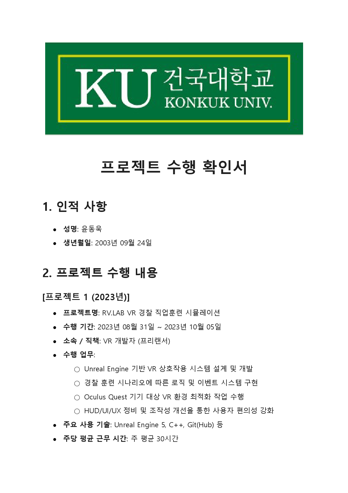
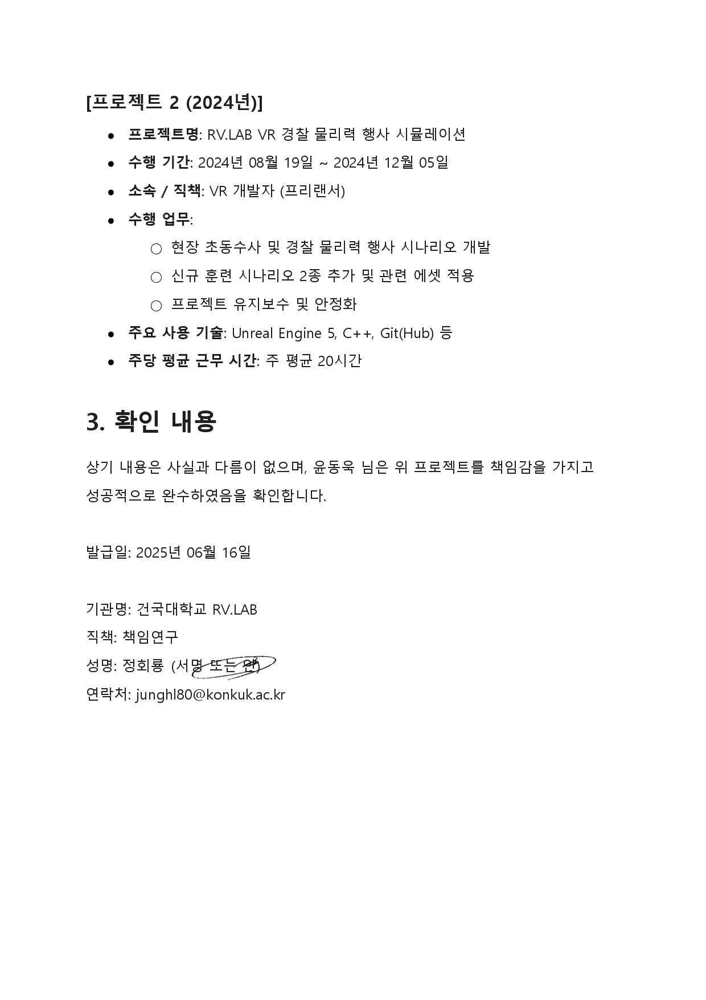
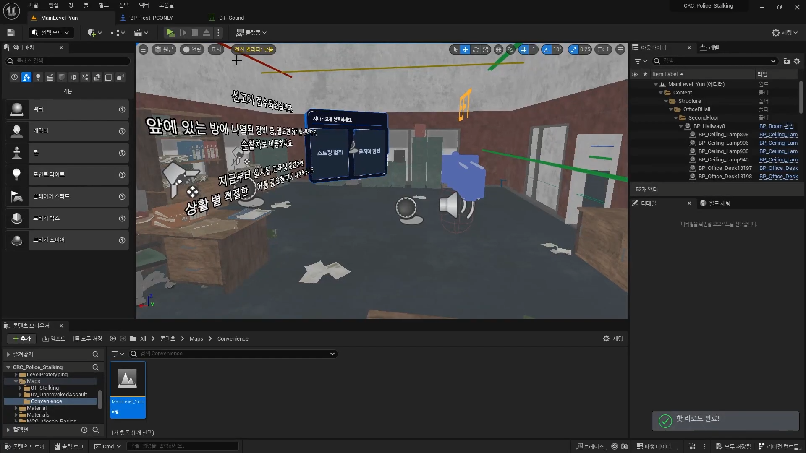
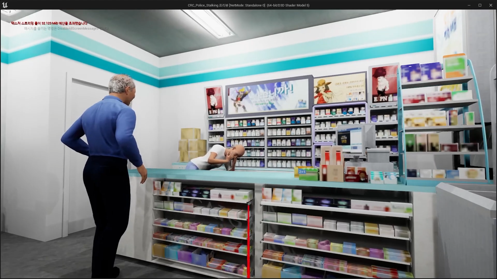
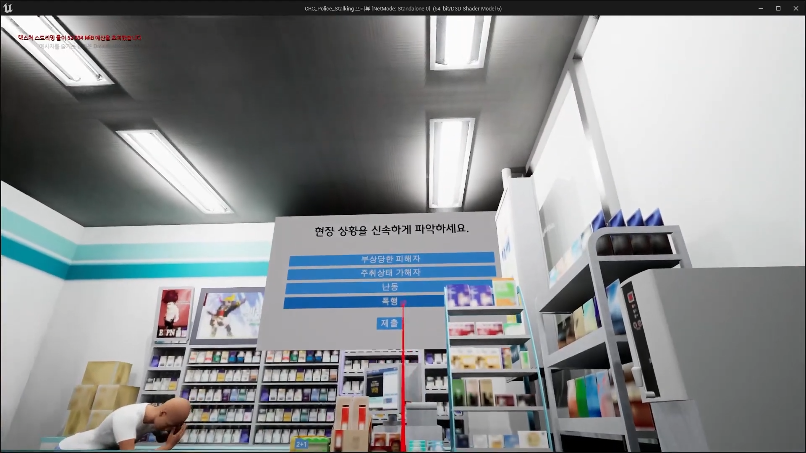
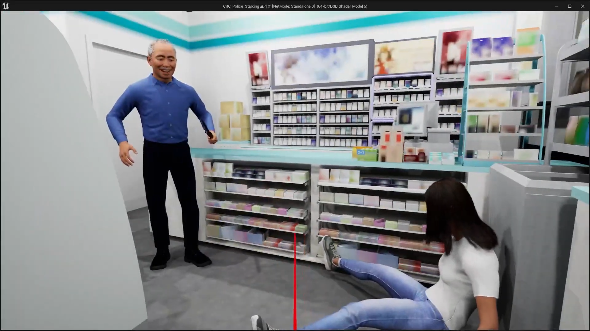
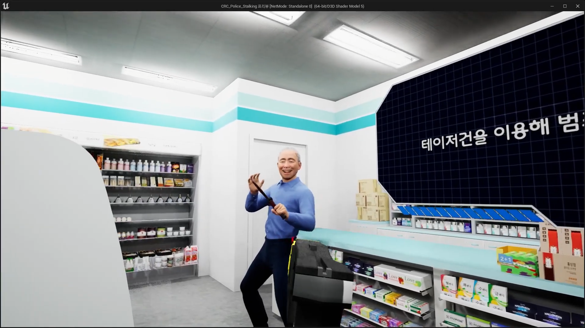
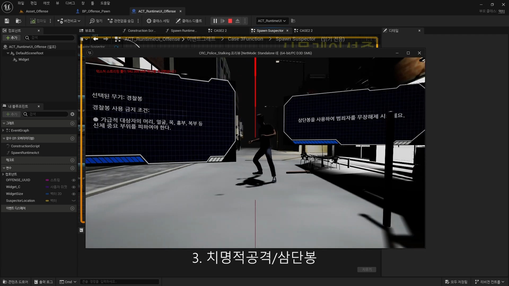
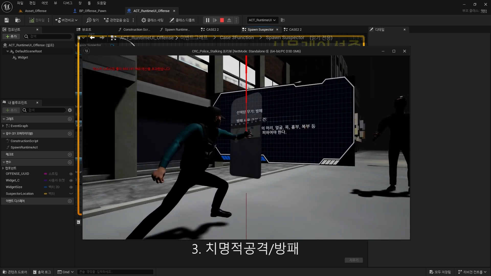

# Konkuk University RV.LAB — Police Scenario VR

[English](Konkuk-RVLab.md) · [한국어](Konkuk-RVLab_ko.md) · [日本語](Konkuk-RVLab_ja.md)

---

## In one line

Commissioned by **Konkuk University RV.LAB**.

**Unreal Engine 5 · Meta Quest** training VR for **situation-based police scenarios**.  
Put on a headset, walk a field-like case, and practice how to respond.

Source stays with the lab / client, so this page is **what shipped** and **what I owned** — not a public code drop.

Work is backed by the professor’s **project completion certificate** below.

---

## Why this project

Classroom slides don’t let you repeat, under pressure,  
things like “gas smell, door locked, person at risk”  
or “a customer is rampaging in a store.”

This project fills that gap with **scenario-sized training maps** that run on Quest.

Goals were:

- Practice the chain: assess → approach → talk / control / protect
- Hit the **protocol / decision points** written for each situation, once, in VR
- Keep interaction and performance **playable on mobile VR (Quest)**

---

## Player loop

Roughly this loop:

```text
Pick scenario
    ↓
Put on Quest · enter the scene (locomotion / interaction)
    ↓
Event triggers (call context, NPC behavior, hazards …)
    ↓
Player actions (dialogue · search · control · protect …)
    ↓
Branch / outcome
    ↓
Next step or scenario end (HUD / UI guidance)
```

That loop only works if each scenario ties together  
**logic & events**, **interaction**, **HUD/UI**, and Quest **perf / packaging**.

That was the band of work I was on.

---

## Scenarios

Four situation-response maps in **2023**,  
then a **use-of-force** track in **2024**.

| Year | Scenario | Training focus (short) |
|:----:|:---------|:-----------------------|
| 2023 | **Gas leak · suicide attempt** | Hazardous / life-risk scene, approach order, safety |
| 2023 | **Random (unprovoked) crime** | Sudden public violence, control and response |
| 2023 | **Stalking violence** | Victim–offender dynamic, intervene / protect |
| 2023 | **Convenience-store disturbance** | Indoor commercial space, restrain and secure area |
| 2024 | **Police use of force** | Early response + force decisions / procedure in VR |

Each map is closer to **walking the required steps once in context**  
than to a high-score game.

Detailed scripts, internal values, and raw assets stay lab property.

---

## Two engagements

### Phase 1 · 2023 — job-training set

| | |
|:--|:--|
| Name | RV.LAB VR police **job-training** simulation |
| Dates | 2023.08.31 – 2023.10.05 |
| Role | VR developer (freelance) |
| Load | ~**30h / week** avg (per certificate) |

**Work listed on the certificate**

- Design & build **VR interaction** on Unreal
- **Logic & event** systems for police training scenarios
- **Oculus Quest** environment **optimization**
- **HUD / UI / UX** cleanup for clearer controls and guidance

In this phase I focused on tightening the whole pipeline  
and making scenarios **swappable** without rebuilding everything.

I also polished details outside the paid scope.  
The professor liked that care and offered a **full researcher position**.

I had already signed and even arranged housing,  
but **family circumstances** kept me from going.

It still stings a little —  
I still wonder now and then what it would have been like if I had stayed in the lab.

### Phase 2 · 2024 — use of force · extend

| | |
|:--|:--|
| Name | RV.LAB VR police **use-of-force** simulation |
| Dates | 2024.08.19 – 2024.12.05 |
| Role | VR developer (freelance) |
| Load | ~**20h / week** avg (per certificate) |

**Work listed on the certificate**

- **Early-response** and **use-of-force** scenario development
- **Two new** training scenarios + related assets
- **Maintenance & stability** on the existing project

Same interaction / event backbone as 2023,  
with force / first-response content layered on  
and the build kept healthy.

---

## What I developed

I can’t open-source the project,  
but the work split roughly like this:

| Area | Scope |
|:-----|:------|
| **Interaction** | Grab, approach, dialogue/choices, prop response — Quest controllers |
| **Scenario logic** | Step flow, event fire, pass/fail / next-beat handoff |
| **UI / HUD** | In-training prompts, control hints, scenario feedback |
| **Platform** | Quest performance, packaging, device checks |
| **Content** | Scenario & asset adds, upkeep of existing maps |

Day-to-day, inside the lab pipeline:

**scenario brief → UE level/logic → Quest build**.

---

## Stack

| | |
|:--|:--|
| Engine | **Unreal Engine 5** |
| Language | **C++** (with Blueprint where the project mixed) |
| Target | **Meta Quest / Oculus** standalone VR |
| Collab | **Git / GitHub** |

Built as a **headset-first** package,  
not a PC-VR-only showcase.

---

## What can / can’t be public

| OK to show | Not public |
|:-----------|:-----------|
| Overview, scenario list, role, dates | Source, internal BP/C++ |
| Certificate copy | Full protocol text, unapproved captures |
| (soon) partial test video | Unreleased lab assets |

This page is **portfolio write-up + proof**,  
not a demo repo.

Clips land in Media when ready.

---

## Certificate

Copy of the completion certificate issued by the lab lead.  
(Name, periods, duties, and stack match the sections above.)

<p align="center">
  
</p>

<p align="center">
  
</p>

PDF: [certificate-signed-copy.pdf](assets/certificate-signed-copy.pdf)

### What the images say (English)

The document is written in **Korean**.  
Below is a plain translation of the main fields so non-Korean readers can follow the scans.

**Header**  
Konkuk University · **Project Completion Certificate**

**1. Personal information**

- Name: Yoon Dong-wook (윤동욱)
- Date of birth: 2003-09-24

**2. Project work**

*Project 1 (2023)*

- Title: RV.LAB VR **police job-training** simulation
- Period: **2023-08-31 ~ 2023-10-05**
- Affiliation / role: **VR developer (freelance)**
- Duties:
  - Design and development of **VR interaction** systems on Unreal Engine
  - **Logic and event** systems for police training scenarios
  - **VR environment optimization** for **Oculus Quest**
  - **HUD / UI / UX** improvements for usability
- Main tech: Unreal Engine 5, C++, Git(Hub), etc.
- Workload: about **30 hours per week** on average

*Project 2 (2024)*

- Title: RV.LAB VR **police use-of-force** simulation
- Period: **2024-08-19 ~ 2024-12-05**
- Affiliation / role: **VR developer (freelance)**
- Duties:
  - Development of **early-response** and **police use-of-force** scenarios
  - Addition of **two new** training scenarios and related assets
  - **Maintenance and stabilization** of the project
- Main tech: Unreal Engine 5, C++, Git(Hub), etc.
- Workload: about **20 hours per week** on average

**3. Confirmation**

The issuer confirms the above is accurate  
and that Yoon Dong-wook completed the projects successfully with responsibility.

- Issue date: **2025-06-16**
- Organization: **Konkuk University RV.LAB**
- Title of issuer: Principal Investigator / responsible researcher
- Signature / contact of the professor: as on the original document

---

## Media

In-game and editor captures.  
(Some frames still show texture-streaming warnings from a dev preview build.)

### 1. Scenario select · level setup (UE Editor)

<p align="center">
  
</p>

**Caption**

Unreal Editor on `MainLevel_Yun` / `CRC_Police_Stalking`.

Center panel lets trainees pick scenarios such as **stalking** and **unprovoked assault**.  
The content browser shows map folders like `01_Stalking`, `02_UnprovokedAssault`, and `Convenience`.

Training copy (“call received”, move with the right gear for the situation)  
and interaction prompts sit in the level viewport.

### 2. Convenience-store scenario — victim state

<p align="center">
  
</p>

**Caption**

In-game convenience-store view.

One character is slumped over the counter;  
another in a blue shirt stands beside them.

Staging for an **injured victim / post-disturbance** beat,  
with shelves, register, and product layout filling out the commercial interior.

### 3. Scene assessment UI (checklist)

<p align="center">
  
</p>

**Caption**

Same store space with the prompt **“Assess the scene quickly.”**

Checklist options: **injured victim**, **intoxicated suspect**, **disturbance**, **assault**, then submit.

Trainees must **identify situation factors**, not only watch the scene.

### 4. Threat escalation — victim down

<p align="center">
  
</p>

**Caption**

The blue-shirt character brandishes a dark baton-like object while smiling;  
a person in white sits collapsed against the wall.

Convenience-store scenario beat for **heightened aggression**  
and the need to protect the victim.

### 5. Force option guidance (e.g. taser)

<p align="center">
  
</p>

**Caption**

Same aggressor near the counter with the baton raised.  
A large panel starts with **“Use a taser to …”** style equipment guidance.

Shows the training flow where **which tool to use** is instructed and chosen,  
not only a fight animation.

### 6. Use of force — expandable baton

<p align="center">
  
</p>

**Caption**

2024 use-of-force track.

Outdoor / facility corridor; a suspect stands mid-frame.

UI: **selected weapon: police baton**,  
no-go zones (head, face, neck, etc.),  
and the order **“Disarm the offender with the expandable baton.”**

Bottom label: `3. Lethal attack / baton` — step-based weapon training.

Left: `ACT_RuntimeUI_Offense` Blueprint graph  
(runtime UI / spawn logic) open in the editor.

### 7. Use of force — shield

<p align="center">
  
</p>

**Caption**

Same track with a **shield** ready stance.

UI: **selected weapon: shield**,  
protected zones (head, face, neck, chest, abdomen, …),  
bottom label `3. Lethal attack / shield`.

Pairs with the baton shot to show  
**equipment swaps on the same training pipeline**.

---

*Full test playthrough video will be added here when ready.*
