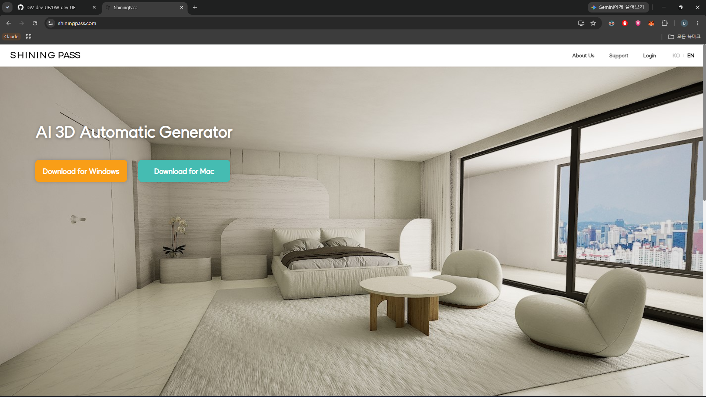
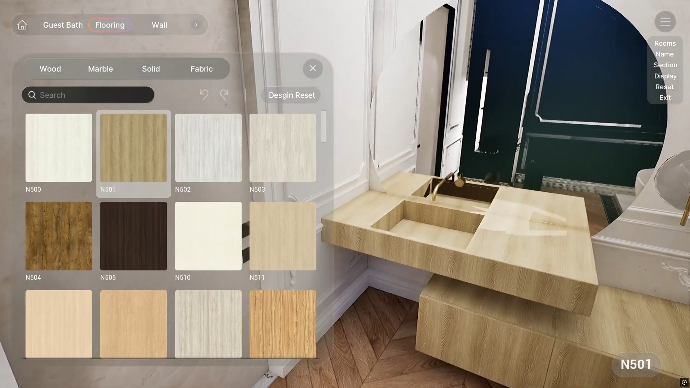
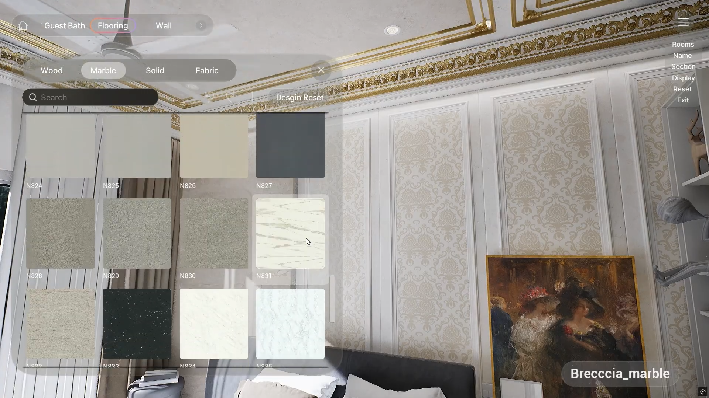
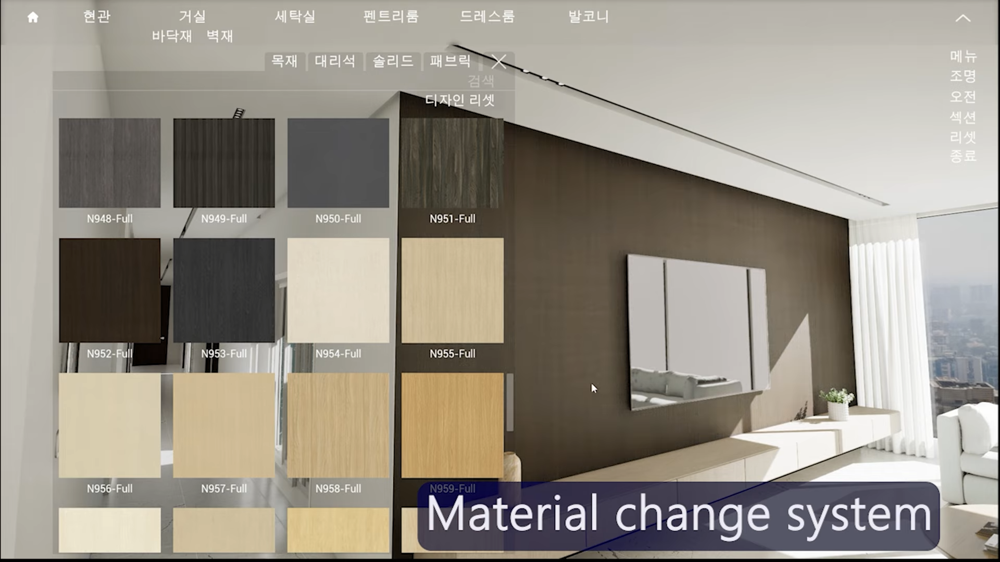

# ShiningPass — 건축 인테리어 플랫폼

[English](ShiningPass.md) · [한국어](ShiningPass_ko.md) · [日本語](ShiningPass_ja.md)

---

## 한 줄로

**Python + AWS**로 백엔드·프론트(공식 홈페이지)를 만들고,  
인증된 고객사만 들어갈 수 있는 **UE5 클라이언트**까지 이은 건축 인테리어 시스템입니다.

웹에서 고객사를 유치·관리하고,  
클라이언트 안에서는 공간의 **재질·가구**를 바꿔 보며 설계를 검토합니다.

**공식 홈페이지:** [https://shiningpass.com](https://shiningpass.com)

---

## 프로젝트의 이유

건축·인테리어 영업/검토 과정에서  
“이 마감재로 바꾸면 공간이 어떻게 보이지?”를  
도면만으로는 고객에게 바로 보여 주기 어렵습니다.

ShiningPass는 그 간극을 줄이기 위해

1. **웹**으로 브랜드·고객 유입·계정 관리  
2. **UE5 클라이언트**로 실사에 가까운 공간 체험·자재 교체  

를 한 줄로 묶은 구조입니다.

---

## 전체 구조

```text
공식 홈페이지 (프론트)
        │
        ▼
Python 백엔드  ·  AWS
  · 회원 / 고객사 인증
  · 유저 대시보드
  · 세션·접속 제어
        │
        ▼
UE5 클라이언트 (인증된 고객사만)
  · 공간 탐색
  · 재질 · 가구 변경
  · 다중 머티리얼 미리보기
```

고객사를 유치한 뒤,  
**인증된 계정만** UE5 클라이언트로 접속할 수 있게 막았습니다.

---

## 웹 · 백엔드에서 한 일

| 영역 | 내용 |
|:-----|:-----|
| **공식 홈페이지** | [shiningpass.com](https://shiningpass.com) · 프론트엔드 구현 · 서비스 소개 / 유입 흐름 |
| **백엔드** | Python 기반 API · 비즈니스 로직 |
| **인프라** | **AWS** 위에 배포·연동 |
| **대시보드** | 유저(고객사) 관리용 대시보드 기능 |
| **접속 제어** | 인증된 고객사만 클라이언트 진입 |

### 1계정 · 1접속

> [!TIP]
> 유료 정책이 아니라 보안 정책입니다 — 계정 공유와 다중 접속을 막기 위한 장치예요.

고객사에 발급한 아이디는  
**한 계정당 동시 접속 1곳**만 허용합니다.

다른 PC(또는 다른 세션)에서 같은 계정으로 들어오면  
기존 쪽은 **자동 로그아웃**됩니다.

무단 공유·다중 사용을 줄이기 위한 세션 정책입니다.

---

## UE5 클라이언트에서 한 일

사용자가 건축 인테리어 공간 안에서  
**재질·가구 등을 바꿔 가며** 결과를 바로 볼 수 있게 만들었습니다.

제가 특히 맡은 쪽은 다음과 같습니다.

### 다중 머티리얼 미리보기 (UI)

UI에 자재 스와치(썸네일)를 **여러 장 동시에** 깔아 두고,  
카테고리(목재 / 대리석 / 솔리드 / 패브릭 등) · 검색 · 디자인 리셋과 함께  
고른 뒤 바로 공간에 반영하는 흐름입니다.

스와치가 많아지면 GPU·메모리 부담이 커집니다.  
그래서 미리보기 타일을 매번 새로 만들지 않고  
**오브젝트 풀링**으로 재사용했습니다.

- 화면에 필요한 개수만 활성화  
- 스크롤·필터 변경 시 풀에서 슬롯을 빌려 쓰고 다시 반납  
- 텍스처·위젯 인스턴스 폭주를 막아 **메모리·프레임** 안정화  

하드웨어 메모리와 런타임 최적화가 핵심이었던 구간입니다.

### 클릭 시 레벨 액터 적용

UI에서 머티리얼을 선택하면  
미리보기에서 끝나지 않고,  
**레벨 안 해당 액터(벽·바닥·가구 등)** 에 실제 머티리얼을 적용합니다.

“고른 것 = 공간에 반영된 것”이 되도록  
UI 선택 → 액터 머티리얼 세트를 이었습니다.

### 렌더 · 라이팅

- **DLSS** 적용으로 업스케일 기반 성능 확보  
- UE5 안 **라이팅 세팅 최적화**로 인테리어 공간 품질과 프레임 균형  

---

## 기술 스택

| | |
|:--|:--|
| 클라이언트 | **Unreal Engine 5**, **C++** |
| 서버 · 웹 | **Python**, 프론트엔드 |
| 클라우드 | **AWS** |
| 기타 | 세션 관리, 대시보드, Git 등 |

---

## 화면

### 0. 공식 홈페이지

<p align="center">
  
</p>

**주석**

[shiningpass.com](https://shiningpass.com) 랜딩 화면입니다.

상단 **SHINING PASS** 네비(About Us · Support · Login · KO/EN),  
히어로 문구 **AI 3D Automatic Generator**,  
Windows / Mac 클라이언트 다운로드 버튼이 보입니다.

서비스 소개·유입·다운로드 진입점을 맡았던 **공식 웹 프론트** 쪽 결과물입니다.

### 1. Guest Bath — 바닥재 선택

<p align="center">
  
</p>

**주석**

게스트 배스 공간. 상단에서 **Flooring / Wall**을 고르고,  
**Wood · Marble · Solid · Fabric** 필터와 검색으로 자재 목록을 좁힙니다.

왼쪽 그리드에 `N500` 계열 스와치가 여러 장 깔려 있고,  
오른쪽 세면대·바닥에는 선택한 톤(예: N501)이 반영된 상태입니다.

하단 현재 선택 라벨, **Design Reset**, 우측 Rooms / Reset / Exit 메뉴까지  
“고르기 → 공간에 보기 → 되돌리기” 루프가 한 화면에 들어가 있습니다.

이 그리드가 바로 **다중 머티리얼 미리보기**이고,  
스와치 수가 늘어도 풀링으로 슬롯을 돌리도록 잡았습니다.

### 2. 마블 카테고리 · 고급 침실 톤

<p align="center">
  
</p>

**주석**

같은 머티리얼 UI에서 **Marble** 탭을 연 화면입니다.  
`N824`~`N835` 등 스와치와 검색창, Design Reset이 그대로 보입니다.

배경은 금색 몰딩·패브릭 벽·클래식 침실 연출이고,  
우하단에 `Breccia_marble`처럼 **현재 적용 중인 머티리얼 이름**이 표시됩니다.

카테고리만 바꿔도 그리드 슬롯은 재사용되고,  
클릭 시 레벨 쪽 액터 머티리얼이 바뀌는 흐름이 이어집니다.

### 3. 거실 — Material change system

<p align="center">
  
</p>

**주석**

거실·월 유닛 공간. 상단 룸 탭(현관 / 거실 / 세탁실 / 팬트리 / 드레스룸 / 발코니)과  
**바닥재 · 벽재** 전환, 목재·대리석·솔리드·패브릭 필터가 보입니다.

왼쪽 패널에 `N948-Full` ~ `N959-Full` 등 **Full** 스와치가 격자 배치되어 있고,  
우측 큰 벽면·TV 월에 선택 톤이 적용된 모습입니다.

화면 아래 **Material change system** 라벨처럼,  
이 클라이언트의 핵심이 “목록 미리보기 + 실공간 반영”임을 보여 주는 컷입니다.

룸·부위·카테고리를 바꿔도 같은 UI 파이프라인을 쓰므로,  
풀링·적용 로직이 한 세트로 유지되는 구조입니다.

---

## 한 줄 정리

| | |
|:--|:--|
| 웹 | 공식 홈페이지 + 고객 유치 · 인증 |
| 서버 | Python · AWS · 대시보드 · **1계정 1접속** |
| 클라이언트 | UE5 인테리어 체험 · 재질/가구 변경 |
| 내 포커스 | 다중 머티리얼 미리보기(**오브젝트 풀링**), 액터 적용, DLSS · 라이팅 최적화 |

---

## 공개 범위

> [!IMPORTANT]
> 대시보드 화면, 내부 API, 인프라 구성은 대외비 계약 때문에 비공개이며, 이 페이지에 있는 내용까지만 공개됩니다.

이 페이지에 올린 개요·구조 설명·인게임 캡처까지가 **대외 공개 가능한 범위**입니다.

추가 영상, 관리자·유저 **대시보드 화면**, 내부 API·인프라 구성 등은  
**보안 및 대외비 계약** 때문에 더 이상 공개할 수 없습니다.
